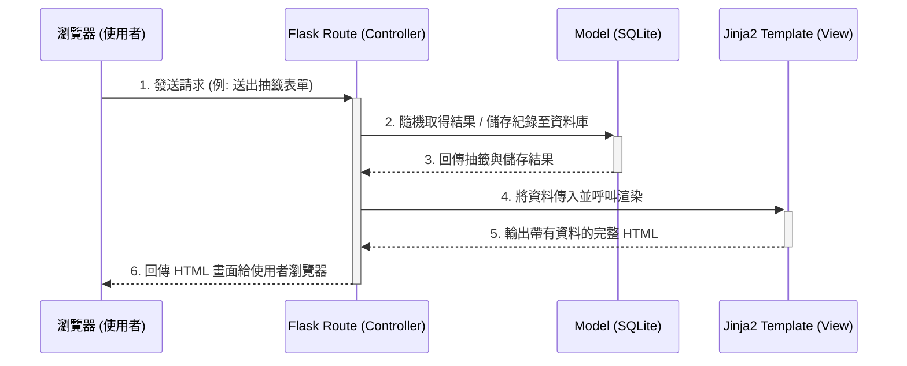

# 系統架構文件：線上算命系統

## 1. 技術架構說明

本系統並未採用前後端分離的架構，而是採用以伺服器端渲染 (Server-Side Rendering, SSR) 為主的 Web 架構，主要基於 Python 的 Flask 框架實作。

- **選用技術與原因**：
  - **後端框架**：Flask。輕量且靈活，適合快速開發中小型專案，學習曲線平緩。
  - **模板引擎**：Jinja2。內建於 Flask，可將後端資料動態渲染為 HTML 後一併傳送給瀏覽器，不僅簡化開發，也易於維護畫面版型。
  - **資料庫**：SQLite。輕量級關聯式資料庫，無需額外安裝設定即可以單一檔案形式運作，很適合處理與儲存本系統中單純的算命紀錄資料。

- **MVC 模式說明**：
  - **Model (模型)**：負責定義資料結構與資料庫操作邏輯（如：讀取籤詩庫、儲存使用者算命紀錄）。
  - **View (視圖)**：負責將資料轉換成使用者介面呈現。在 Flask 中，View 由 `templates` 目錄下的 Jinja2 HTML 模板負責。
  - **Controller (控制器)**：由 Flask Route 擔任。負責接收來自使用者的網頁請求（如點擊算命按鈕），調用對應的 Model 處理資料，最後將結果傳遞給 View 去渲染。

## 2. 專案資料夾結構

本專案將採用以下資料夾結構來維持程式碼的整潔與維護性：

```text
web_app_development/
├── app/                      ← 應用程式主目錄
│   ├── models/               ← 資料庫模型 (Model)，負責定義與操作 SQLite
│   │   ├── init_db.py        ← 資料庫初始化與建表腳本
│   │   └── history.py        ← 提供操作算命紀錄的函數或類別
│   ├── routes/               ← Flask 路由 (Controller)，處理邏輯
│   │   ├── main.py           ← 首頁與一般介紹頁面
│   │   └── divination.py     ← 處理抽籤、儲存與分享等核心邏輯
│   ├── templates/            ← HTML 模板 (View)
│   │   ├── base.html         ← 共同版型 (Header, Footer, 共用樣式)
│   │   ├── index.html        ← 首頁
│   │   ├── result.html       ← 算命結果展示與分享頁
│   │   └── history.html      ← 歷史紀錄查詢頁
│   └── static/               ← CSS / JS 等靜態資源
│       ├── css/
│       │   └── style.css     ← 自訂樣式表
│       ├── js/
│       │   └── main.js       ← 增加互動性之 JavaScript
│       └── images/           ← 圖片等素材 (籤詩圖、背景等)
├── instance/                 ← 不受版控管理，存放特定環境檔案
│   └── database.db           ← SQLite 資料庫檔案
├── app.py                    ← 程式入口，負責初始化 Flask app 與註冊 Blueprint
├── requirements.txt          ← 記錄專案所有 Python 依賴套件
└── README.md                 ← 專案說明文件
```

## 3. 元件關係圖

以下展示了系統核心處理請求的流程：



## 4. 關鍵設計決策

1. **以 Blueprint 拆分路由檔案**
   - **原因**：為了避免所有的路由邏輯都擠在 `app.py` 中造成維護困難，我們預先按業務邏輯將路由拆分為 `main` (一般頁面) 與 `divination` (算命核心)。如此能讓程式碼架構更清晰，擴充功能時不易造成衝突。

2. **Server-Side Rendering (SSR) 搭配有限的 JavaScript**
   - **原因**：基於技術限制與簡化開發的考量，畫面主要由 Jinja2 在伺服器端渲染好再回傳。然而，為了滿足「一鍵重新占卜」及「快速分享」的使用者體驗，會搭配少量的 JavaScript (如 Fetch API 或 Clipboard API) 在前端輔助操作，兼顧開發效率與好的體驗。

3. **使用單一檔案的 SQLite 資料庫**
   - **原因**：本系統為 MVP 型態的輕量級線上工具，主要讀寫為使用者的個人紀錄與查閱固定的籤詩庫。由於初期無大規模高併發需求，SQLite 的效能已非常足夠，且能大幅降低環境配置的門檻，不需額外架設資料庫伺服器。

4. **亂數抽籤邏輯實作於後端**
   - **原因**：雖然隨機數也能由前端 JS 產生，但將核心抽籤演算法放在後端，不僅可以結合資料庫寫入機制確保結果的一致性，也能確保未來若要實作「每日限定免費次數」等複雜商業邏輯時，不會輕易遭到使用者透過竄改前端代碼破壞規則。
