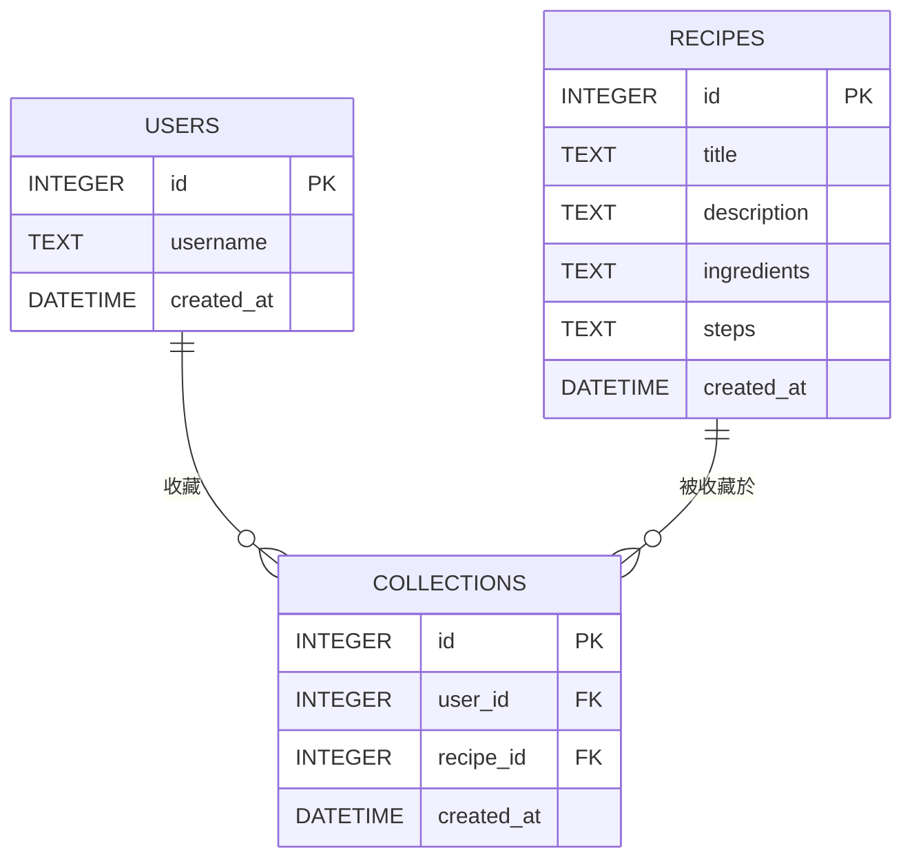

# 資料庫設計文件：食譜收藏夾系統

本文件基於系統架構與功能需求，定義了 SQLite 資料庫的結構，包含實體關係圖 (ER Diagram)、資料表詳細說明，以及對應的 Model 設計。

## 1. ER 圖 (實體關係圖)

## 2. 資料表詳細說明

### 2.1. `users` 資料表 (使用者)
負責儲存系統中的使用者資料，以支援多用戶的獨立收藏夾。
- `id` (INTEGER): 使用者唯一識別碼，Primary Key，自動遞增。
- `username` (TEXT): 使用者名稱，必填，需為唯一值 (UNIQUE)。
- `created_at` (DATETIME): 帳號建立時間，預設為當前時間。

### 2.2. `recipes` 資料表 (食譜)
儲存所有的食譜內容。為求 MVP 快速開發，`ingredients` (材料) 與 `steps` (步驟) 先以純文字 (TEXT) 形式儲存，可包含換行符號。
- `id` (INTEGER): 食譜唯一識別碼，Primary Key，自動遞增。
- `title` (TEXT): 食譜名稱，必填。
- `description` (TEXT): 食譜簡介。
- `ingredients` (TEXT): 材料清單，必填。
- `steps` (TEXT): 烹飪步驟，必填。
- `created_at` (DATETIME): 食譜建立時間，預設為當前時間。

### 2.3. `collections` 資料表 (收藏紀錄)
紀錄哪個使用者收藏了哪份食譜，屬於多對多關聯的中介表。
- `id` (INTEGER): 收藏紀錄唯一識別碼，Primary Key，自動遞增。
- `user_id` (INTEGER): 關聯的使用者，Foreign Key 參照 `users.id`，必填。
- `recipe_id` (INTEGER): 關聯的食譜，Foreign Key 參照 `recipes.id`，必填。
- `created_at` (DATETIME): 加入收藏的時間，預設為當前時間。
- *限制*：同一個使用者對同一篇食譜只能有一筆收藏紀錄 (UNIQUE(user_id, recipe_id))。

## 3. SQL 建表語法
完整的建表語法已儲存於 `database/schema.sql` 檔案中。

## 4. Python Model 程式碼
Model 程式碼位於 `app/models/` 目錄下，使用內建的 `sqlite3` 實作資料庫的 CRUD 操作：
- `db.py`: 提供資料庫連線的共用函式。
- `recipe.py`: 提供食譜的新增、查詢、搜尋、更新與刪除。
- `user.py`: 提供使用者管理，以及收藏夾的加入、移除與查詢功能。
