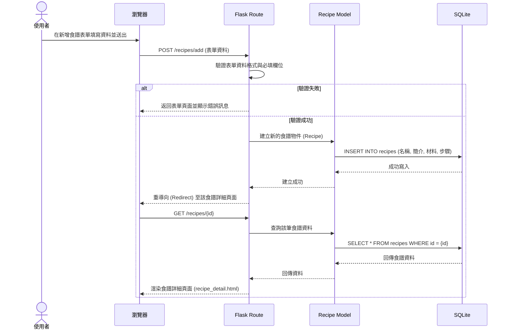

# 流程圖文件：食譜收藏夾系統

本文件根據 PRD 與系統架構，呈現了使用者的操作流程、系統背後的資料互動序列，以及各功能的 URL 對照表。

## 1. 使用者流程圖 (User Flow)

此流程圖展示了使用者進入系統後，可以進行的各項主要操作路徑。

```mermaid
flowchart LR
    A([使用者進入網站]) --> B[首頁 - 食譜推薦與最新食譜]
    B --> C{選擇操作}
    
    C -->|搜尋食譜| D[輸入關鍵字並送出]
    D --> E[食譜列表 (搜尋結果)]
    E --> F[點擊特定食譜]
    
    C -->|瀏覽食譜| E
    
    C -->|新增食譜| G[進入新增表單]
    G --> H[填寫名稱、簡介、材料、步驟]
    H --> I{送出表單}
    I -->|驗證失敗| G
    I -->|驗證成功| F
    
    C -->|查看我的收藏| J[收藏夾列表]
    J --> F
    
    F[食譜詳細頁面] --> K{選擇操作}
    K -->|加入/移除收藏| L[更新收藏狀態]
    L --> F
    K -->|返回| C
```

## 2. 系統序列圖 (Sequence Diagram)

此圖描述「使用者點擊新增食譜」到「資料成功存入資料庫」的完整技術流程。



## 3. 功能清單對照表

以下為 MVP 範圍內各主要功能所對應的 URL 路徑與 HTTP 方法規劃：

| 功能名稱 | 頁面或操作說明 | URL 路徑 | HTTP 方法 |
| :--- | :--- | :--- | :--- |
| **首頁與推薦** | 顯示首頁內容，包含隨機/最新食譜推薦 | `/` | GET |
| **瀏覽食譜清單** | 列出所有食譜或顯示搜尋結果 | `/recipes` | GET |
| **查看食譜詳細** | 顯示單一食譜的材料與步驟 | `/recipes/<int:recipe_id>` | GET |
| **進入新增表單** | 顯示新增食譜的 HTML 表單 | `/recipes/add` | GET |
| **送出新增資料** | 處理表單資料並存入資料庫 | `/recipes/add` | POST |
| **切換收藏狀態** | 將食譜加入收藏或取消收藏 | `/recipes/<int:recipe_id>/collect` | POST |
| **我的收藏夾** | 列出使用者已收藏的所有食譜 | `/collections` | GET |
