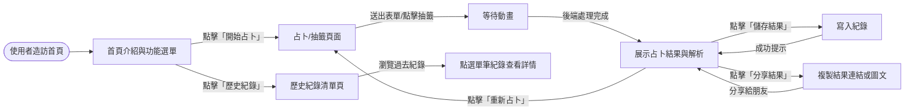
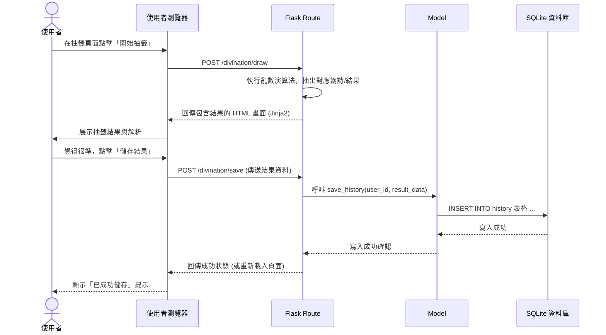

# 流程圖文件：線上算命系統

本文件根據 PRD 與系統架構，視覺化了使用者的操作路徑（User Flow）以及系統內部的資料流動歷程（System Sequence Diagram），並附上主要功能的路由設計。

## 1. 使用者流程圖（User Flow）

以下流程圖說明使用者從進入網站開始，可能會經歷的操作路徑：

## 2. 系統序列圖（Sequence Diagram）

以下序列圖詳述「使用者執行抽籤並點選儲存」時，系統背後的運作流程：

## 3. 功能清單對照表

根據上述流程與架構需求，系統預計會實作以下對應的 URL 路徑與 HTTP 請求方法：

| 功能名稱 | URL 路徑 | HTTP 方法 | 說明 |
| :--- | :--- | :--- | :--- |
| 首頁 | `/` | GET | 顯示系統介紹、主要功能入口提示 |
| 抽籤/占卜頁面 | `/divination` | GET | 呈現抽籤介面，可加入注意事項或求籤表單 |
| 執行抽籤邏輯 | `/divination/draw` | POST | 接收抽籤請求，進行後端抽籤邏輯並回傳結果 |
| 儲存算命結果 | `/divination/save` | POST | 將使用者想要保留的算命結果寫入歷史紀錄資料庫中 |
| 歷史紀錄頁面 | `/history` | GET | 查詢該使用者過去儲存過的所有結果並列表呈現 |
| 顯示單一結果 | `/result/<id>` | GET | 呈現特定一筆結果資料（可作為「分享算命結果」的共用網址） |
